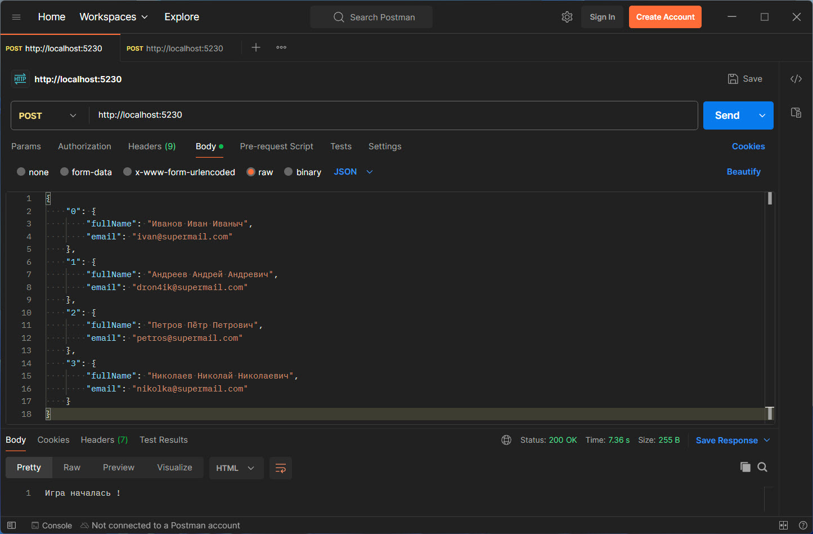
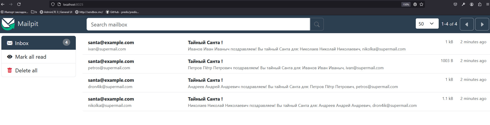

Стек: PHP 8.3 / Symfony 7.0.9

Считаем, что с front приходит следующая JSON структура: 

```json
{
    "0": {
        "fullName": "Иванов Иван Иваныч",
        "email": "ivan@supermail.com"
    },
    "1": {
        "fullName": "Андреев Андрей Андревич",
        "email": "dron4ik@supermail.com"
    },
    "2": {
        "fullName": "Петров Пётр Петрович",
        "email": "petros@supermail.com"
    },
    "3": {
        "fullName": "Николаев Николай Николаевич",
        "email": "nikolka@supermail.com"
    }
}
```
Отправка запроса через Postman:



